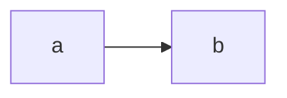
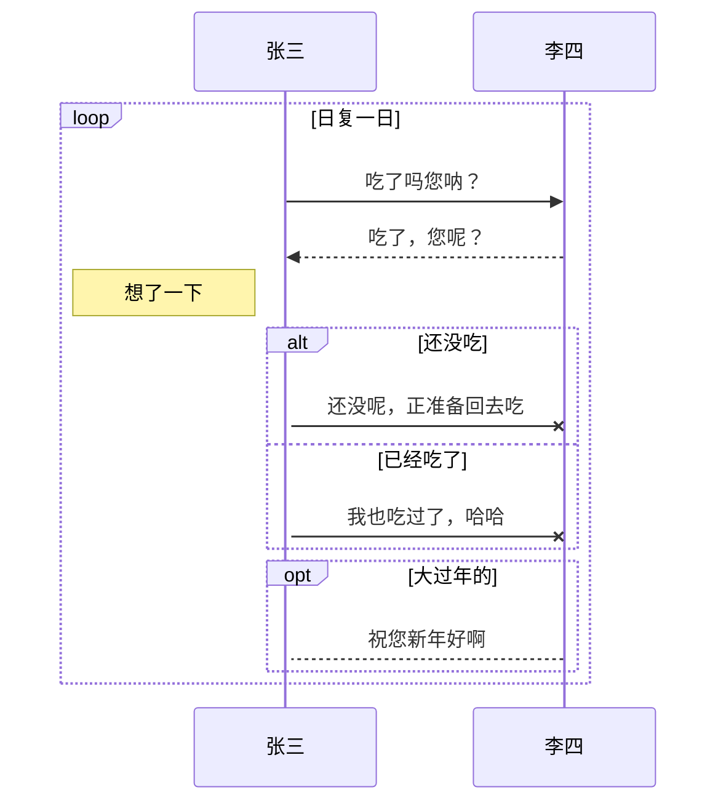

### test mermaid

### just test
are you ok

### table
|a|b|c|
|-|-|-|
|1|2|3|

### test flow
```flow
st=>start: Start
op=>operation: Your Operation
cond=>condition: Yes or No?
e=>end
st->op->cond
cond(yes)->e
cond(no)->op
```
### test some complex


### 开始了
``` 以上都是test(废话), 下边开始
 _     _   _      _              _
| |___| |_( )___ | |__  ___ __ _(_)_ _
| / -_)  _|/(_-< | '_ \/ -_) _` | | ' \ 
|_\___|\__| /__/ |_.__/\___\__, |_|_||_|
                           |___/

```
### what
```
1) 把自己的日常生活用数据库管理规划起来
2) 预则立, 找准方向，毕竟现状不会是常态
3) 对自己的生活现状和未来做一个规划
4) 自问一声 =>
                                        _     ___
     __ _ _ _ ___   _  _ ___ _  _   ___| |__ |__ \
    / _` | '_/ -_) | || / _ \ || | / _ \ / /   /_/
    \__,_|_| \___|  \_, \___/\_,_| \___/_\_\  (_)
                    |__/

   大声回答 =>
     ___                    _
    |_ _|  __ _ _ __    ___| |__
     | |  / _` | '  \  / _ \ / /
    |___| \__,_|_|_|_| \___/_\_\

   -- 2020-10-19 23:43 continue by capten in wuhan 山水年华

   这是生活规划系统, 此系统涵盖如下内容 all stay in mysql database

   1.生活方式管理
   2.工作目标管理
   3.往后余生管理
   4.生存技能管理
   5.程序技能管理
```
### why
### how


