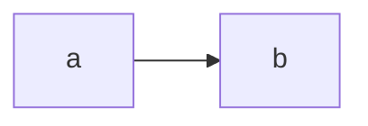

### test mermaid

### just test
are you ok

### table
|a|b|c|
|-|-|-|
|1|2|3|

### tes flow
```flow
st=>start: Start
op=>operation: Your Operation
cond=>condition: Yes or No?
e=>end
st->op->cond
cond(yes)->e
cond(no)->op
```

